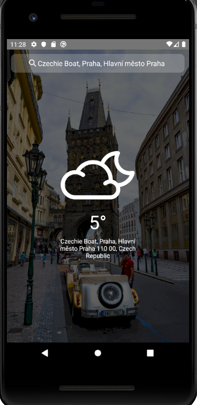

# Weather app with React Native

#### Dependencies

- React Native 0.61.5
- React 16.9.0
- React Navigation 3.11.0

#### Setup

Before you can run the application is necessary to create a `.env` file in the root of the application. This file has the environment variables that are important for the app.

    WEATHER_API_BASE_URL=
    GOOGLE_PLACES_API_KEY=
    GOOGLE_PLACES_API_BASE_URL=https://maps.googleapis.com/maps/api/place

    DEFAULT_LAYOUT_BACKGROUND=

The `WEATHER_API_BASE_URL` variable is the base URL to the weather service. It could be your own service but it has to have a route `/weather` where the app is requesting for the weather data. [Here](https://github.com/srLitem/node-weather-webApp) an example of the weather service.

The `GOOGLE_PLACES_API_KEY` is the key what all requests to the [Google Place API](https://developers.google.com/places/web-service/intro?utm_source=google&utm_medium=cpc&utm_campaign=FY18-Q2-global-demandgen-paidsearchonnetworkhouseads-cs-maps_contactsal_saf&utm_content=text-ad-none-none-DEV_c-CRE_417765871429-ADGP_Hybrid+%7C+AW+SEM+%7C+SKWS+~+Places+%7C+BMM+%7C+Places+API-KWID_43700051585816020-aud-669510846654:kwd-475997044718-userloc_9065312&utm_term=KW_%2Bplace%20%2Bapi-ST_%2Bplace+%2Bapi&gclid=Cj0KCQiAnL7yBRD3ARIsAJp_oLYFYfnxedMTZnmg3M-FzfTRgt7lM0ctBiG5M4dMOD_lvfb5ocI7a1caAlF-EALw_wcB) have to have. You can get your API key [here](https://developers.google.com/places/web-service/get-api-key)

The `DEFAULT_LAYOUT_BACKGROUND` is the URL for the background image that appears when there is no valid image from the weather web service.

## How to start

1. Clone repository.

- `git clone https://github.com/Guerrero25/native-weather`

2. Install dependencies

- `npm install`

3. Run the project

- `react-native run-android` or `react-native run-ios`
